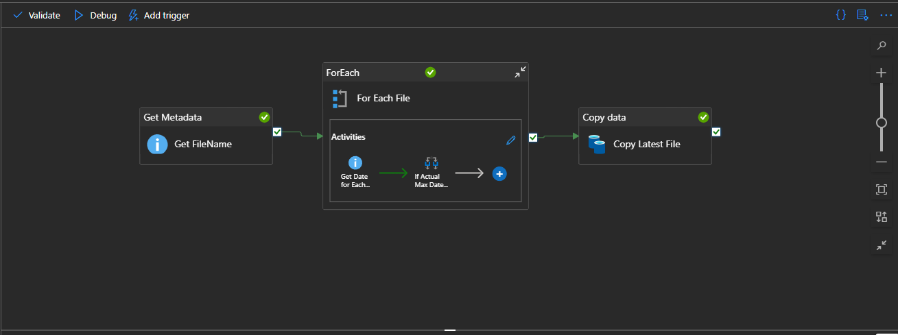
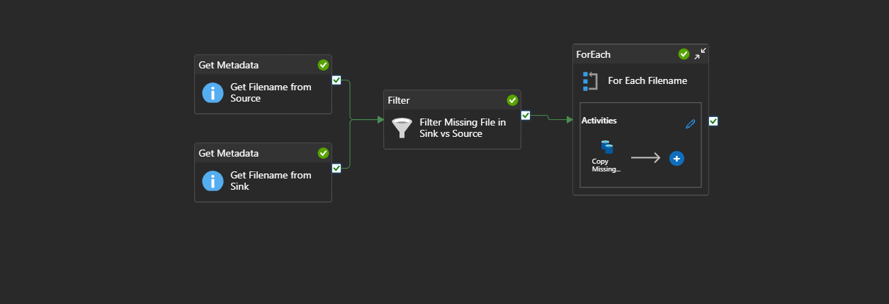
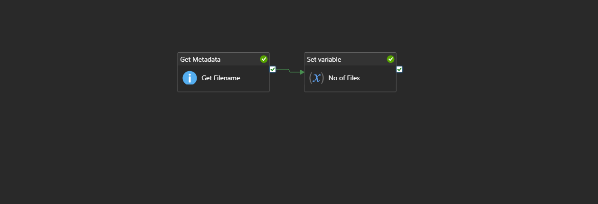
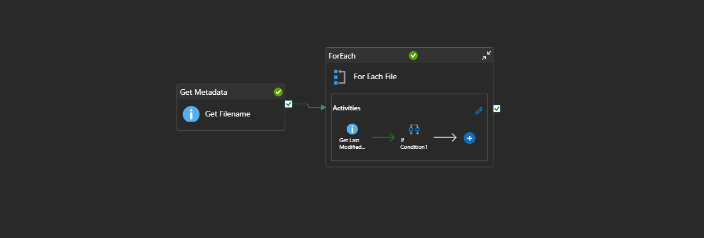

# 🛠️ Azure Data Factory: Advanced Real-Time Scenarios Project

## 🌟 Project Overview

This repository showcases a set of production-ready pipelines built within Azure Data Factory (ADF) to solve 4 complex, real-world data engineering challenges. The focus is on implementing robust, dynamic, and cost-effective solutions for scenarios that go beyond basic data movement.

The project demonstrates proficiency in using ADF's control flow activities, dynamic content, and metadata management for enterprise-level ETL/ELT pipelines.

### 🚀 Key Technologies

| Technology | Purpose |
| :--- | :--- |
| **Azure Data Factory (ADF)** | Orchestration, Control Flow, Data Movement. |
| **Azure Data Lake Storage Gen2 (ADLS)** | Source and Sink storage for file-based operations. |

---

## 🏗️ Project Architecture

The solution follows a standard hub-and-spoke pattern where ADF acts as the central orchestration engine interacting with the data plane in ADLS Gen2 and the control plane in Azure SQL DB.

``

### 💡 Dynamic Dataset Parameterization

All datasets (`ds_adf_scenario_source`, `ds_adf_scenario_sink`) are parameterized to enable reusable pipelines. The file path is dynamically constructed using pipeline parameters:

* **File Path Example:** `adf-scenarios/@{dataset().scenario}/source`
    * This allows a single pipeline to be run against different **scenario** test folders simply by changing the pipeline parameter.

---

## 🎯 Advanced Scenarios & Solution Breakdown

Each scenario is implemented as a dedicated ADF pipeline, designed for efficiency and reusability.

### **1. Incremental Loading by Timestamp (Watermark)**
* **Screenshot:** 
* **Objective:** Copy only files that have been newly created or modified since the last successful pipeline run.
* **Pipeline Logic:**
    * **Get Metadata:** Fetches the list of source files (`ChildItems`).
    * **ForEach:** Iterates through each file.
    * **Get Metadata (Inside Loop):** Retrieves the `LastModifiedDate` for the current file.
    * **If Condition:** Compares the file's `LastModifiedDate` against the stored watermark value (stored a default value in parameter `file_max_date` : `2000-01-01T00:00:00Z` ).
    * **Copy data:** Executes **only** if the file is newer than the watermark.
      

### **2. Copy Only the Missing Files (Data Reconciliation)**
* **Screenshot:** 
* **Objective:** Compare the files in the source and sink locations and copy over files that are **missing** from the sink.
* **Pipeline Logic:**
    * **Get Metadata (Source) & Get Metadata (Sink):** Run in parallel to fetch file lists from both locations.
    * **Filter:** Uses a dynamic expression to subtract the Sink file list from the Source file list, resulting in an array of missing filenames.
    * **ForEach:** Iterates over the filtered list of missing files.
    * **Copy Missing...:** Copies the individual missing file to the sink location.
      
      
### **3. Storing the Number of Files in a Variable (Auditing)**
* **Screenshot:** 
* **Objective:** Count the total number of files in a container and store the result in a variable for logging, monitoring, or conditional logic.
* **Pipeline Logic:**
    * **Get Metadata:** Retrieves the file list (`ChildItems`).
    * **Set variable:** Sets a pipeline variable named `No of Files` using the expression:
        `@length(activity('Get Filename').output.childItems)`

      
### **4. File Deletion and Retention Policy**
* **Screenshot:** 
* **Objective:** Implement a scheduled cleanup policy to delete files older than a defined retention period (e.g., 30/90 days).
* **Pipeline Logic:**
    * **Get Metadata:** Fetches all filenames from the target folder.
    * **ForEach:** Iterates through each file.
    * **Get Last Modified...:** Retrieves the file's `LastModifiedDate`.
    * **If Condition:** Checks if the `LastModifiedDate` is older than the calculated cutoff date (e.g., `subtractFromTime(utcnow(), 90, 'Day')`).
    * **Delete Activity:** (Contained within the successful branch of the `If Condition`) Executes the deletion of the old file.

---

## 📦 Repository Structure and Deployment

| Folder / File | Description
| :--- | :--- |
| `assets/` | Contains all supporting images (`scenario_1.png`, `ds_adf_scenario_source.png`, etc.).
| `scenario_1/` | Folder containing pipeline, dataset, and linked service JSON for Scenario 1.
| `scenario_2/` | Folder containing pipeline, dataset, and linked service JSON for Scenario 2.
| `scenario_3/source/` | Folder for sample data needed for Scenario 3.
| `README.md` | You are here.
